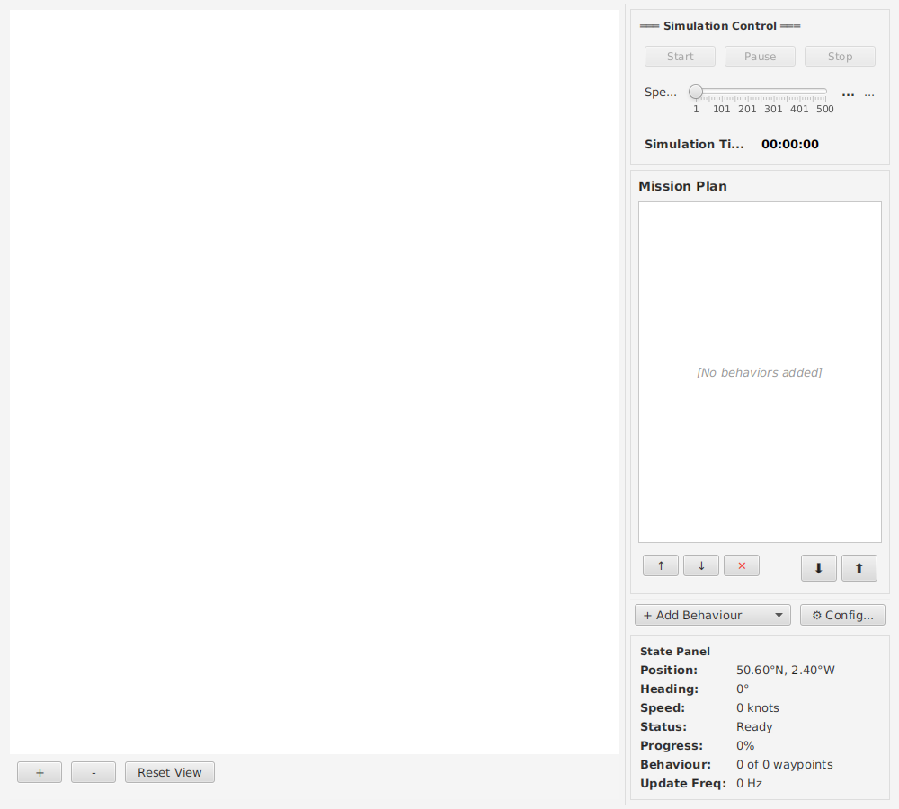
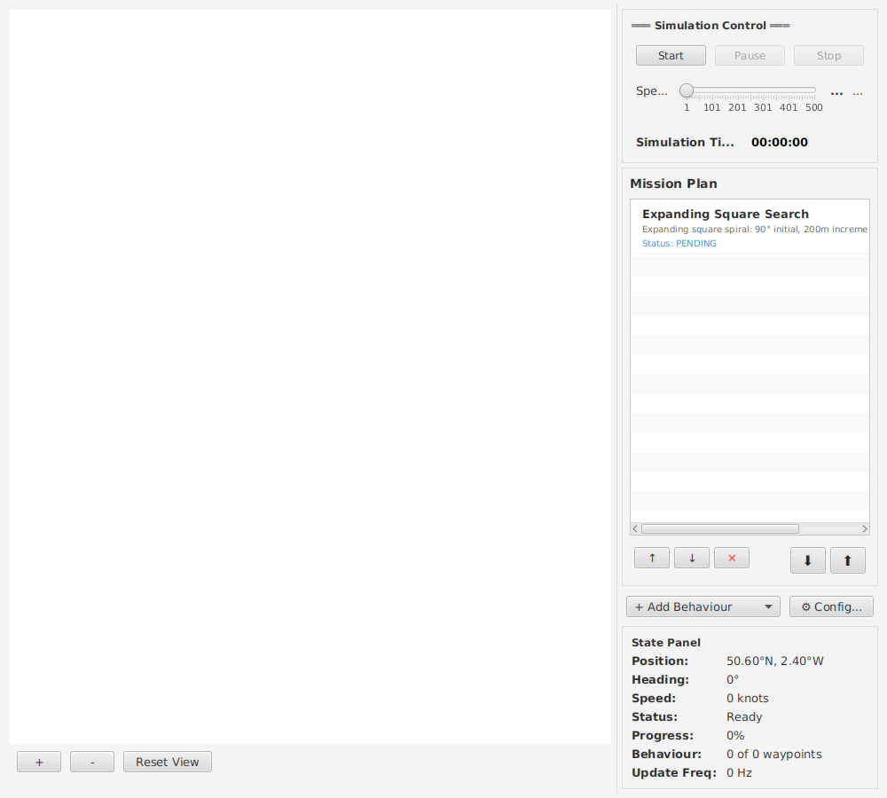
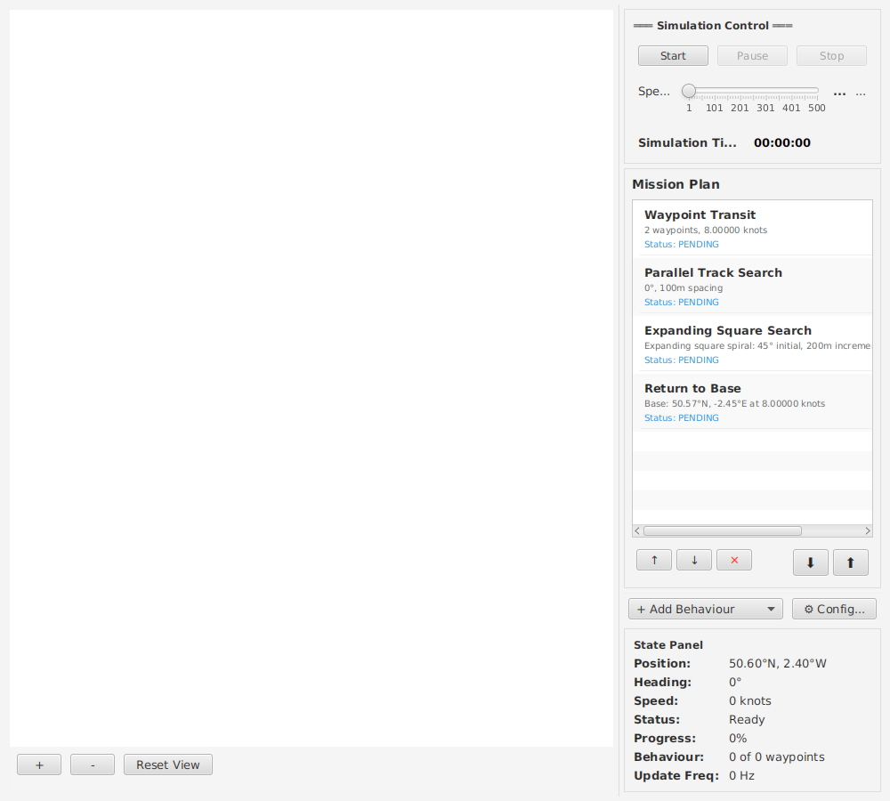
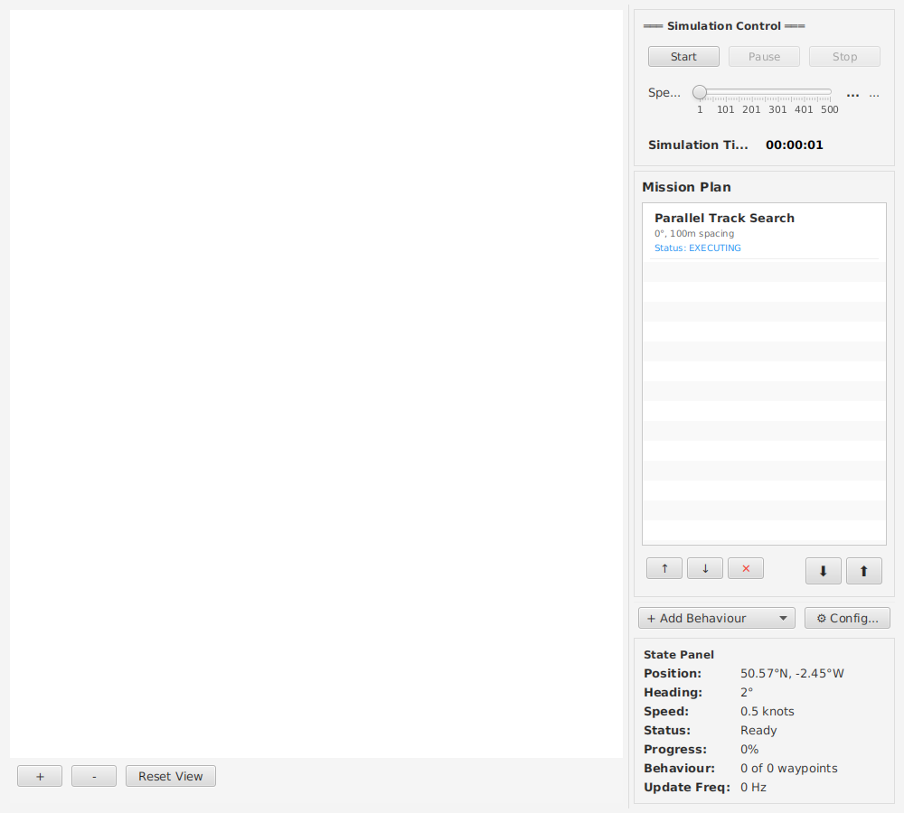

# USV Mission Planner & Simulator

A JavaFX desktop application for planning and simulating Unmanned Surface Vehicle (USV) mine clearance missions. Users draw search patterns on a map, configure mission behaviors, and execute realistic simulations with platform dynamics.

## Screenshots

### Application Startup

The main application window showing the map panel (left), mission plan panel (top right), control panel (middle right), and state panel (bottom right). The interface is ready for mission planning in Portland Harbour.

### Parallel Track Search Pattern

A parallel track search behavior configured with 45° orientation and 150m spacing. The systematic grid coverage pattern is visualized with waypoints showing the planned search path.

### Expanding Square Search Pattern

An expanding square search behavior starting from the centroid and spiraling outward with 200m leg increments. This pattern is ideal for localized area searches.

### Multi-Behavior Mission

A complete multi-phase mission with four sequential behaviors: waypoint transit to the search area, parallel track search, expanding square search, and return to base. Each behavior is listed in the mission plan panel with its parameters.

### Simulation Execution

The simulation in progress, showing the USV platform navigating the planned route. The state panel displays real-time position, heading, speed, and progress information. Track history is visible on the map.

## Features

### Mission Planning (US1)
- Draw search areas on map (polygon with 3+ vertices)
- Automatic parallel track pattern generation
- Configurable orientation (0-360°) and spacing
- Real-time waypoint visualization

### Mission Execution (US2)
- **Realistic Platform Dynamics**:
  - Turn radius (configurable, default 200m)
  - Acceleration/deceleration limits
  - Speed constraints (max 8 knots)
  - Smooth curved navigation paths

- **Simulation Controls**:
  - Start/Pause/Stop buttons
  - Time acceleration slider (1× to 20×)
  - Real-time position and heading tracking
  - Track history visualization

### Multi-Behavior Missions (US3)
- **Four Behavior Types**:
  - Parallel Track Search - systematic grid coverage
  - Waypoint Transit - navigate to user-specified points
  - Return to Base - return to starting position
  - Expanding Square Search - spiral pattern from centroid

- **Mission Management**:
  - Add/remove/reorder behaviors
  - Sequential execution with transitions
  - Real-time progress display

### Real-Time State Monitoring (US5)
- Platform position and heading
- Speed and acceleration status
- Current behavior and waypoint progress
- Elapsed simulation time
- Update frequency (Hz)

## Quick Start

### Prerequisites
- Java 25+
- Maven 3.8+

### Build & Run
```bash
mvn clean install
mvn javafx:run
```

### Create Your First Mission
1. Start the application
2. Click on map to draw a search polygon (3+ points)
3. Right-click → Add Behaviour → Parallel Track Search
4. Set orientation (0-360°) and spacing (meters)
5. Click "Start" to run simulation
6. Observe USV movement with realistic dynamics

## Testing

```bash
# All tests (116 tests)
mvn test

# Unit tests only
mvn test -Dtest="*Test"

# Integration tests
mvn test -Dtest="*IntegrationTest"

# E2E tests
mvn test -Dtest="*E2ETest"

# Code coverage
mvn jacoco:prepare-agent test jacoco:report
# View: target/site/jacoco/index.html
```

## Architecture

**Tech Stack**: Java 25, JavaFX 21, JTS Topology Suite, Maven

**Project Structure**:
```
src/main/java/com/planetmayo/usvsim/
├── model/               # Mission entities
│   ├── behaviour/       # 4 behavior types
│   ├── mission/         # Mission composition
│   ├── geometry/        # Position, Waypoint, Polygon
│   └── platform/        # State and dynamics
├── view/                # JavaFX UI
│   ├── dialogs/         # Behavior config dialogs
│   └── panels/          # Map, Control, State panels
├── controller/          # Application logic
│   ├── SimulationEngine # Real-time simulator
│   └── MissionController
└── util/                # Utilities
    ├── GeoUtils         # Great circle nav
    ├── SearchPatternGenerator
    └── PolygonUtils
```

## Performance

- **60 FPS** target at 1× speed
- **<100ms** UI response
- **<500ms** pattern generation
- **<512MB** memory usage

## Development Notes

- TDD for business logic (>80% coverage)
- Mockup-first UI development
- MVC architecture enforced
- Thread-safe simulation engine
- Input validation on all dialogs

## Status

✅ **Production Ready (MVP)**
- All 5 user stories implemented
- 116/116 tests passing
- All validation and error handling in place

## Future Enhancements

- Platform configuration dialog (P3)
- CSS styling improvements
- FPS profiling overlay
- Mission save/load
- Multi-platform simulation

---

**Last Updated**: 2025-10-24
**Branch**: 001-usv-mission-planner
